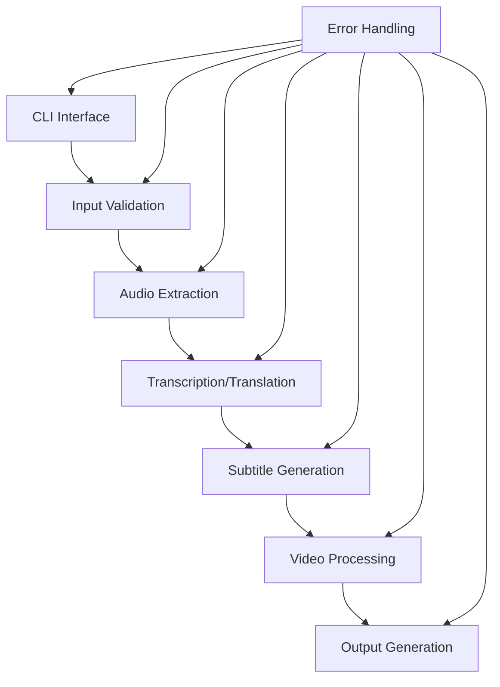

# System Patterns: Video Subtitling Tool

## Architecture Overview

## Component Relationships

### Core Components
1. **CLI Interface** (main.py)
   - Parses command-line arguments
   - Orchestrates the overall workflow
   - Provides user feedback

2. **Audio Processing** (audio.py)
   - Extracts audio from video files
   - Prepares audio for transcription

3. **Transcription Engine** (transcribe.py)
   - Interfaces with Whisper
   - Handles language detection and translation
   - Processes audio to text

4. **Subtitle Management** (subtitles.py)
   - Formats transcriptions into SRT format
   - Handles timing and text segmentation

5. **Video Processing** (video.py)
   - Interfaces with FFmpeg
   - Embeds subtitles into video
   - Handles video encoding/decoding

6. **Utilities** (utils.py)
   - Manages temporary files
   - Provides helper functions
   - Handles logging and error reporting

## Design Patterns

### Command Pattern
- The CLI interface acts as an invoker
- Each processing step is encapsulated as a command
- Commands are executed in sequence

### Pipeline Pattern
- Data flows through a series of processing stages
- Each stage transforms the data and passes it to the next stage
- Allows for clean separation of concerns

### Factory Pattern
- Used for creating appropriate processors based on input parameters
- Allows for future extension to support different video formats or languages

### Singleton Pattern
- Used for resource-intensive components like FFmpeg and Whisper interfaces
- Ensures efficient resource utilization

## Error Handling Strategy
- Each component includes robust error checking
- Errors are propagated up the chain with context
- Temporary files are cleaned up even in error cases
- User-friendly error messages are displayed

## Future Extension Points
- Support for additional source languages
- Custom subtitle styling options
- Batch processing of multiple videos
- Integration with video editing workflows
